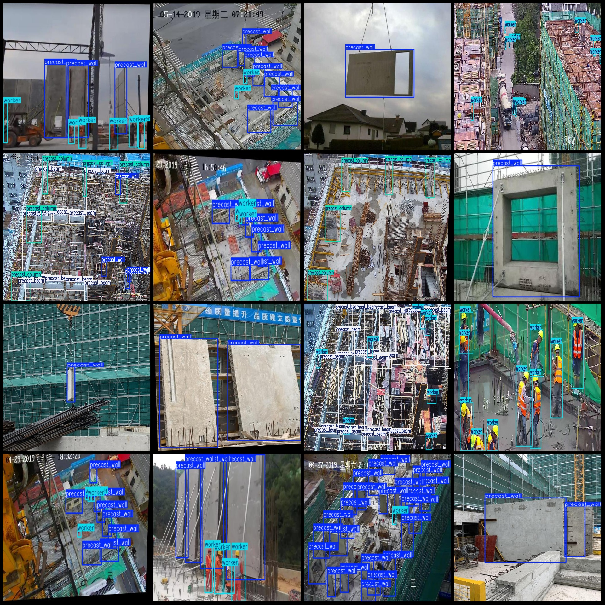
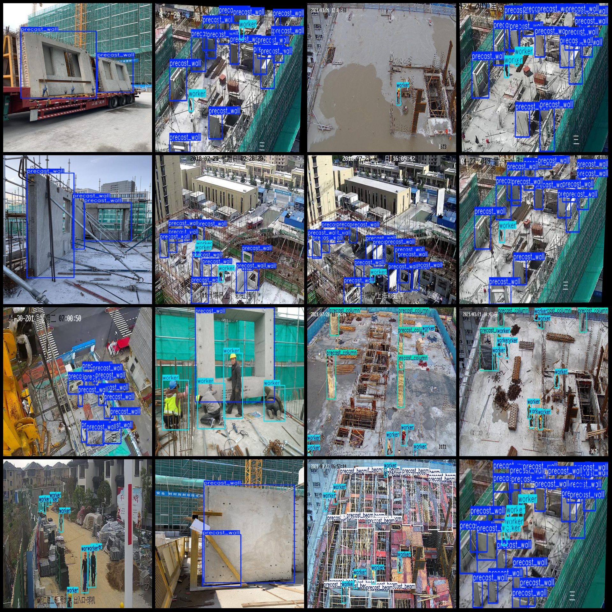

# Smart Construction Customized Cement Board Beam Wall Columns and Detection Dataset - 1,482 Images in 5 Categories

Dataset format: Pascal VOC format + YOLO format (txt files without split paths, only containing jpg images along with corresponding VOC format xml files and YOLO format txt files)
Number of images (jpg file counts): 1,482
Number of annotations (xml file counts): 1,482
Number of annotations (txt file counts): 1,482
Number of categories: 5
Annotation categories names (note that the order of categories in the YOLO format does not correspond to this, but is based on the "labels" folder's "classes.txt"): ["precast_beam", "precast_column", "precast_slab", "precast_wall", "worker"]
Box count for each category:
- Precast beam box count = 3643
- Precast column box count = 1214
- Precast slab box count = 2815
- Precast wall box count = 4358
- Worker box count = 7850
Total box count: 19880
Dataset enhancement: Yes, approximately 900 are original images with remaining enhanced images mainly rotation enhancement
Image resolution: Multi-resolution images, such as 2048x1152, 1840x860, etc.
Annotation tool used: labelImg
Annotation rules: Draw a rectangle around the category
Important notice: No specific statement has been made at this time
Special declaration: This dataset does not guarantee any accuracy in the training models or weight files
Image previews:
## Images

Here is a pay link on Stripe ( https://buy.stripe.com/3cs8yP7sY87d0vu9AB ). Please contact me lonlonago@foxmail.com after funding $89, and I will send you a complete data files , thank you!

